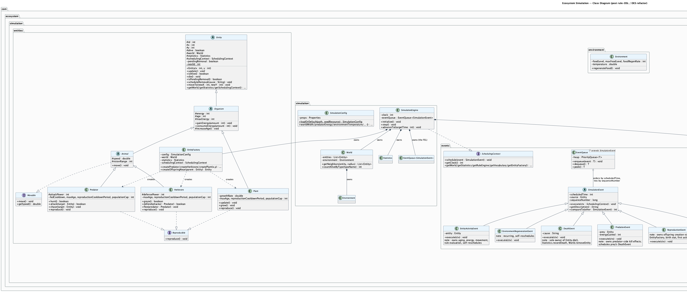
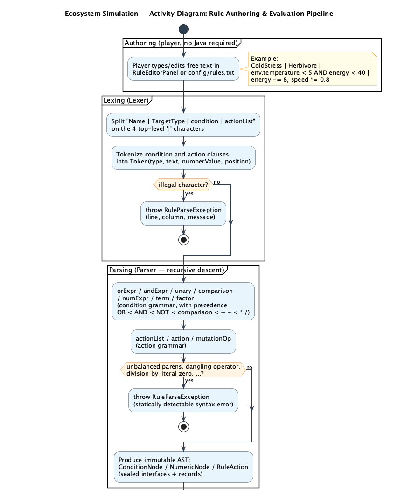
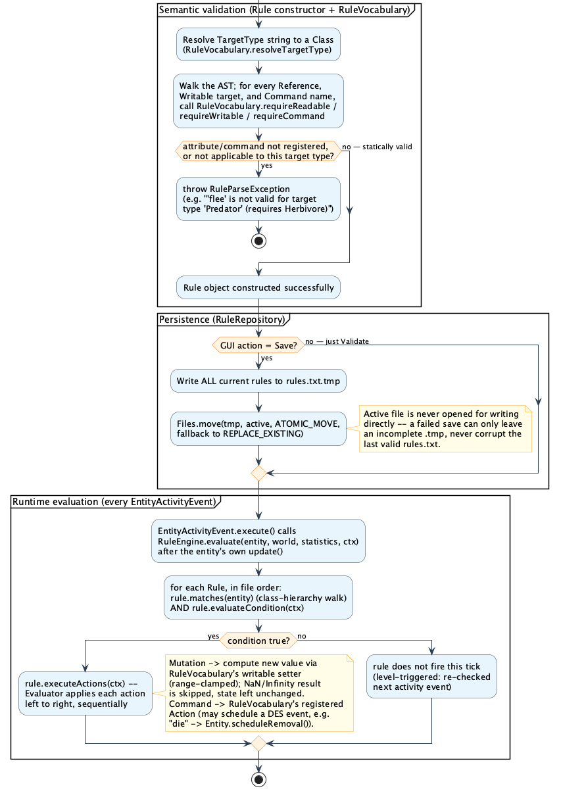
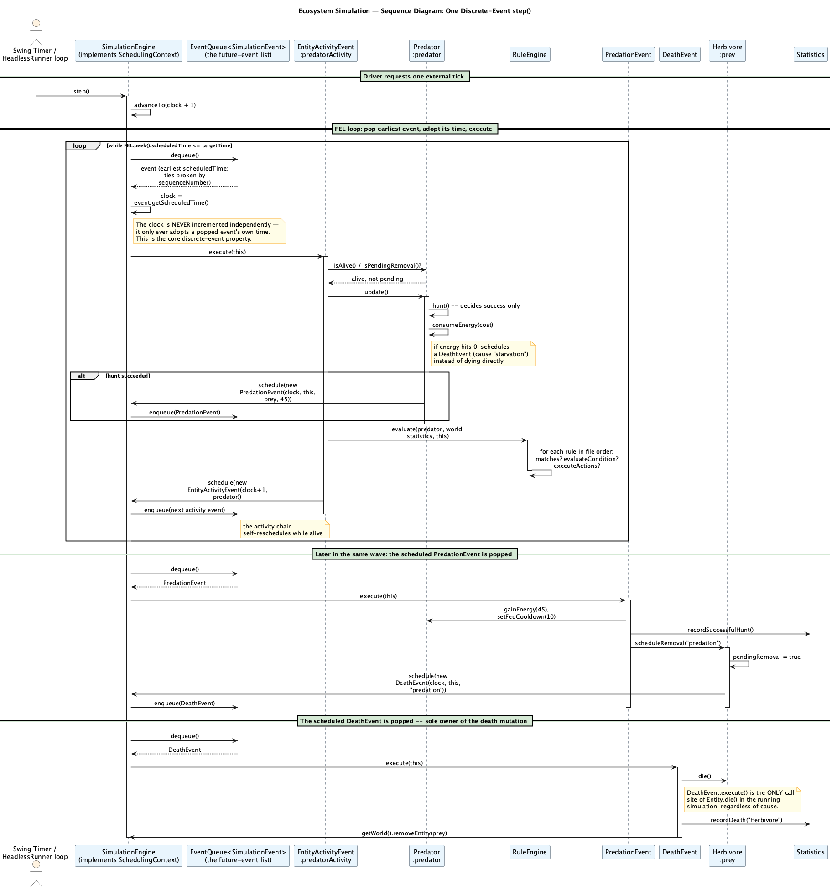
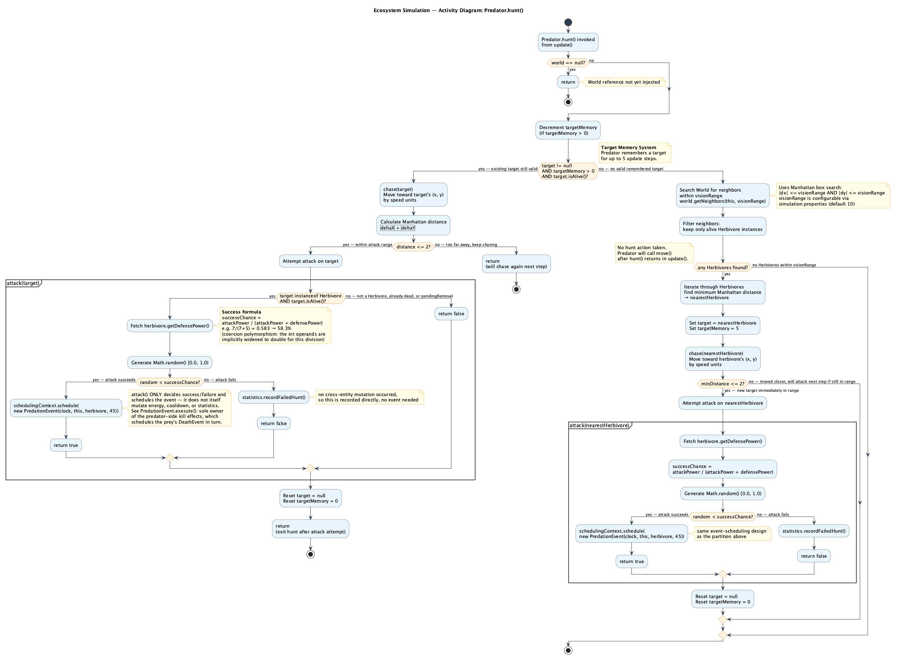

```{=openxml}
<w:p><w:pPr><w:jc w:val="center"/><w:spacing w:before="3000" w:after="240"/></w:pPr><w:r><w:rPr><w:b/><w:sz w:val="80"/><w:szCs w:val="80"/></w:rPr><w:t xml:space="preserve">Ecosystem Simulation</w:t></w:r></w:p>
<w:p><w:pPr><w:jc w:val="center"/><w:spacing w:after="720"/></w:pPr><w:r><w:rPr><w:i/><w:sz w:val="36"/><w:szCs w:val="36"/></w:rPr><w:t xml:space="preserve">Java-Based OOP Project Report — Final Report</w:t></w:r></w:p>
<w:p><w:pPr><w:jc w:val="center"/><w:spacing w:after="160"/></w:pPr><w:r><w:rPr><w:sz w:val="26"/><w:szCs w:val="26"/></w:rPr><w:t xml:space="preserve">University of Messina</w:t></w:r></w:p>
<w:p><w:pPr><w:jc w:val="center"/><w:spacing w:after="160"/></w:pPr><w:r><w:rPr><w:sz w:val="26"/><w:szCs w:val="26"/></w:rPr><w:t xml:space="preserve">Course: Data Analysis</w:t></w:r></w:p>
<w:p><w:pPr><w:jc w:val="center"/><w:spacing w:after="480"/></w:pPr><w:r><w:rPr><w:sz w:val="26"/><w:szCs w:val="26"/></w:rPr><w:t xml:space="preserve">Professor: Salvatore Distefano</w:t></w:r></w:p>
<w:p><w:pPr><w:jc w:val="center"/><w:spacing w:after="160"/></w:pPr><w:r><w:rPr><w:b/><w:sz w:val="26"/><w:szCs w:val="26"/></w:rPr><w:t xml:space="preserve">Name: </w:t></w:r><w:r><w:rPr><w:sz w:val="26"/><w:szCs w:val="26"/></w:rPr><w:t xml:space="preserve">Yermek Aubayev</w:t></w:r></w:p>
<w:p><w:pPr><w:jc w:val="center"/></w:pPr><w:r><w:rPr><w:b/><w:sz w:val="26"/><w:szCs w:val="26"/></w:rPr><w:t xml:space="preserve">Matricula Number: </w:t></w:r><w:r><w:rPr><w:sz w:val="26"/><w:szCs w:val="26"/></w:rPr><w:t xml:space="preserve">551098</w:t></w:r></w:p>
<w:p><w:r><w:br w:type="page"/></w:r></w:p>
<w:p><w:pPr><w:pStyle w:val="TOCHeading" /></w:pPr><w:r><w:t xml:space="preserve">Table of Contents</w:t></w:r></w:p>
<w:p><w:pPr><w:tabs><w:tab w:val="right" w:leader="dot" w:pos="8640"/></w:tabs><w:ind w:left="0"/><w:spacing w:before="120" w:after="60"/></w:pPr><w:r><w:rPr><w:b/><w:sz w:val="22"/><w:szCs w:val="22"/></w:rPr><w:t xml:space="preserve">1. Introduction</w:t></w:r><w:r><w:rPr><w:b/><w:sz w:val="22"/><w:szCs w:val="22"/></w:rPr><w:tab/></w:r><w:r><w:rPr><w:b/><w:sz w:val="22"/><w:szCs w:val="22"/></w:rPr><w:t xml:space="preserve">4</w:t></w:r></w:p>
<w:p><w:pPr><w:tabs><w:tab w:val="right" w:leader="dot" w:pos="8640"/></w:tabs><w:ind w:left="360"/><w:spacing w:before="60" w:after="60"/></w:pPr><w:r><w:rPr><w:sz w:val="22"/><w:szCs w:val="22"/></w:rPr><w:t xml:space="preserve">1.1 Purpose of the Project</w:t></w:r><w:r><w:rPr><w:sz w:val="22"/><w:szCs w:val="22"/></w:rPr><w:tab/></w:r><w:r><w:rPr><w:sz w:val="22"/><w:szCs w:val="22"/></w:rPr><w:t xml:space="preserve">4</w:t></w:r></w:p>
<w:p><w:pPr><w:tabs><w:tab w:val="right" w:leader="dot" w:pos="8640"/></w:tabs><w:ind w:left="720"/><w:spacing w:before="60" w:after="60"/></w:pPr><w:r><w:rPr><w:sz w:val="22"/><w:szCs w:val="22"/></w:rPr><w:t xml:space="preserve">1.1.1 Build a Functional Discrete-Event Ecosystem Simulation</w:t></w:r><w:r><w:rPr><w:sz w:val="22"/><w:szCs w:val="22"/></w:rPr><w:tab/></w:r><w:r><w:rPr><w:sz w:val="22"/><w:szCs w:val="22"/></w:rPr><w:t xml:space="preserve">4</w:t></w:r></w:p>
<w:p><w:pPr><w:tabs><w:tab w:val="right" w:leader="dot" w:pos="8640"/></w:tabs><w:ind w:left="720"/><w:spacing w:before="60" w:after="60"/></w:pPr><w:r><w:rPr><w:sz w:val="22"/><w:szCs w:val="22"/></w:rPr><w:t xml:space="preserve">1.1.2 Demonstrate Object-Oriented Programming Principles</w:t></w:r><w:r><w:rPr><w:sz w:val="22"/><w:szCs w:val="22"/></w:rPr><w:tab/></w:r><w:r><w:rPr><w:sz w:val="22"/><w:szCs w:val="22"/></w:rPr><w:t xml:space="preserve">5</w:t></w:r></w:p>
<w:p><w:pPr><w:tabs><w:tab w:val="right" w:leader="dot" w:pos="8640"/></w:tabs><w:ind w:left="360"/><w:spacing w:before="60" w:after="60"/></w:pPr><w:r><w:rPr><w:sz w:val="22"/><w:szCs w:val="22"/></w:rPr><w:t xml:space="preserve">1.2 System Components and Architecture</w:t></w:r><w:r><w:rPr><w:sz w:val="22"/><w:szCs w:val="22"/></w:rPr><w:tab/></w:r><w:r><w:rPr><w:sz w:val="22"/><w:szCs w:val="22"/></w:rPr><w:t xml:space="preserve">5</w:t></w:r></w:p>
<w:p><w:pPr><w:tabs><w:tab w:val="right" w:leader="dot" w:pos="8640"/></w:tabs><w:ind w:left="720"/><w:spacing w:before="60" w:after="60"/></w:pPr><w:r><w:rPr><w:sz w:val="22"/><w:szCs w:val="22"/></w:rPr><w:t xml:space="preserve">1.2.1 World and Environment</w:t></w:r><w:r><w:rPr><w:sz w:val="22"/><w:szCs w:val="22"/></w:rPr><w:tab/></w:r><w:r><w:rPr><w:sz w:val="22"/><w:szCs w:val="22"/></w:rPr><w:t xml:space="preserve">5</w:t></w:r></w:p>
<w:p><w:pPr><w:tabs><w:tab w:val="right" w:leader="dot" w:pos="8640"/></w:tabs><w:ind w:left="720"/><w:spacing w:before="60" w:after="60"/></w:pPr><w:r><w:rPr><w:sz w:val="22"/><w:szCs w:val="22"/></w:rPr><w:t xml:space="preserve">1.2.2 Entity Hierarchy</w:t></w:r><w:r><w:rPr><w:sz w:val="22"/><w:szCs w:val="22"/></w:rPr><w:tab/></w:r><w:r><w:rPr><w:sz w:val="22"/><w:szCs w:val="22"/></w:rPr><w:t xml:space="preserve">5</w:t></w:r></w:p>
<w:p><w:pPr><w:tabs><w:tab w:val="right" w:leader="dot" w:pos="8640"/></w:tabs><w:ind w:left="720"/><w:spacing w:before="60" w:after="60"/></w:pPr><w:r><w:rPr><w:sz w:val="22"/><w:szCs w:val="22"/></w:rPr><w:t xml:space="preserve">1.2.3 Discrete-Event Engine</w:t></w:r><w:r><w:rPr><w:sz w:val="22"/><w:szCs w:val="22"/></w:rPr><w:tab/></w:r><w:r><w:rPr><w:sz w:val="22"/><w:szCs w:val="22"/></w:rPr><w:t xml:space="preserve">6</w:t></w:r></w:p>
<w:p><w:pPr><w:tabs><w:tab w:val="right" w:leader="dot" w:pos="8640"/></w:tabs><w:ind w:left="720"/><w:spacing w:before="60" w:after="60"/></w:pPr><w:r><w:rPr><w:sz w:val="22"/><w:szCs w:val="22"/></w:rPr><w:t xml:space="preserve">1.2.4 Rule DSL Pipeline</w:t></w:r><w:r><w:rPr><w:sz w:val="22"/><w:szCs w:val="22"/></w:rPr><w:tab/></w:r><w:r><w:rPr><w:sz w:val="22"/><w:szCs w:val="22"/></w:rPr><w:t xml:space="preserve">7</w:t></w:r></w:p>
<w:p><w:pPr><w:tabs><w:tab w:val="right" w:leader="dot" w:pos="8640"/></w:tabs><w:ind w:left="720"/><w:spacing w:before="60" w:after="60"/></w:pPr><w:r><w:rPr><w:sz w:val="22"/><w:szCs w:val="22"/></w:rPr><w:t xml:space="preserve">1.2.5 EntityFactory and SimulationConfig</w:t></w:r><w:r><w:rPr><w:sz w:val="22"/><w:szCs w:val="22"/></w:rPr><w:tab/></w:r><w:r><w:rPr><w:sz w:val="22"/><w:szCs w:val="22"/></w:rPr><w:t xml:space="preserve">10</w:t></w:r></w:p>
<w:p><w:pPr><w:tabs><w:tab w:val="right" w:leader="dot" w:pos="8640"/></w:tabs><w:ind w:left="720"/><w:spacing w:before="60" w:after="60"/></w:pPr><w:r><w:rPr><w:sz w:val="22"/><w:szCs w:val="22"/></w:rPr><w:t xml:space="preserve">1.2.6 GUI Layer</w:t></w:r><w:r><w:rPr><w:sz w:val="22"/><w:szCs w:val="22"/></w:rPr><w:tab/></w:r><w:r><w:rPr><w:sz w:val="22"/><w:szCs w:val="22"/></w:rPr><w:t xml:space="preserve">10</w:t></w:r></w:p>
<w:p><w:pPr><w:tabs><w:tab w:val="right" w:leader="dot" w:pos="8640"/></w:tabs><w:ind w:left="720"/><w:spacing w:before="60" w:after="60"/></w:pPr><w:r><w:rPr><w:sz w:val="22"/><w:szCs w:val="22"/></w:rPr><w:t xml:space="preserve">1.2.7 Statistics</w:t></w:r><w:r><w:rPr><w:sz w:val="22"/><w:szCs w:val="22"/></w:rPr><w:tab/></w:r><w:r><w:rPr><w:sz w:val="22"/><w:szCs w:val="22"/></w:rPr><w:t xml:space="preserve">11</w:t></w:r></w:p>
<w:p><w:pPr><w:tabs><w:tab w:val="right" w:leader="dot" w:pos="8640"/></w:tabs><w:ind w:left="0"/><w:spacing w:before="120" w:after="60"/></w:pPr><w:r><w:rPr><w:b/><w:sz w:val="22"/><w:szCs w:val="22"/></w:rPr><w:t xml:space="preserve">2. OOP Principles Applied</w:t></w:r><w:r><w:rPr><w:b/><w:sz w:val="22"/><w:szCs w:val="22"/></w:rPr><w:tab/></w:r><w:r><w:rPr><w:b/><w:sz w:val="22"/><w:szCs w:val="22"/></w:rPr><w:t xml:space="preserve">12</w:t></w:r></w:p>
<w:p><w:pPr><w:tabs><w:tab w:val="right" w:leader="dot" w:pos="8640"/></w:tabs><w:ind w:left="360"/><w:spacing w:before="60" w:after="60"/></w:pPr><w:r><w:rPr><w:sz w:val="22"/><w:szCs w:val="22"/></w:rPr><w:t xml:space="preserve">2.1 Encapsulation</w:t></w:r><w:r><w:rPr><w:sz w:val="22"/><w:szCs w:val="22"/></w:rPr><w:tab/></w:r><w:r><w:rPr><w:sz w:val="22"/><w:szCs w:val="22"/></w:rPr><w:t xml:space="preserve">12</w:t></w:r></w:p>
<w:p><w:pPr><w:tabs><w:tab w:val="right" w:leader="dot" w:pos="8640"/></w:tabs><w:ind w:left="360"/><w:spacing w:before="60" w:after="60"/></w:pPr><w:r><w:rPr><w:sz w:val="22"/><w:szCs w:val="22"/></w:rPr><w:t xml:space="preserve">2.2 Information Hiding</w:t></w:r><w:r><w:rPr><w:sz w:val="22"/><w:szCs w:val="22"/></w:rPr><w:tab/></w:r><w:r><w:rPr><w:sz w:val="22"/><w:szCs w:val="22"/></w:rPr><w:t xml:space="preserve">13</w:t></w:r></w:p>
<w:p><w:pPr><w:tabs><w:tab w:val="right" w:leader="dot" w:pos="8640"/></w:tabs><w:ind w:left="360"/><w:spacing w:before="60" w:after="60"/></w:pPr><w:r><w:rPr><w:sz w:val="22"/><w:szCs w:val="22"/></w:rPr><w:t xml:space="preserve">2.3 Inheritance</w:t></w:r><w:r><w:rPr><w:sz w:val="22"/><w:szCs w:val="22"/></w:rPr><w:tab/></w:r><w:r><w:rPr><w:sz w:val="22"/><w:szCs w:val="22"/></w:rPr><w:t xml:space="preserve">15</w:t></w:r></w:p>
<w:p><w:pPr><w:tabs><w:tab w:val="right" w:leader="dot" w:pos="8640"/></w:tabs><w:ind w:left="360"/><w:spacing w:before="60" w:after="60"/></w:pPr><w:r><w:rPr><w:sz w:val="22"/><w:szCs w:val="22"/></w:rPr><w:t xml:space="preserve">2.4 Abstraction</w:t></w:r><w:r><w:rPr><w:sz w:val="22"/><w:szCs w:val="22"/></w:rPr><w:tab/></w:r><w:r><w:rPr><w:sz w:val="22"/><w:szCs w:val="22"/></w:rPr><w:t xml:space="preserve">15</w:t></w:r></w:p>
<w:p><w:pPr><w:tabs><w:tab w:val="right" w:leader="dot" w:pos="8640"/></w:tabs><w:ind w:left="360"/><w:spacing w:before="60" w:after="60"/></w:pPr><w:r><w:rPr><w:sz w:val="22"/><w:szCs w:val="22"/></w:rPr><w:t xml:space="preserve">2.5 Polymorphism</w:t></w:r><w:r><w:rPr><w:sz w:val="22"/><w:szCs w:val="22"/></w:rPr><w:tab/></w:r><w:r><w:rPr><w:sz w:val="22"/><w:szCs w:val="22"/></w:rPr><w:t xml:space="preserve">16</w:t></w:r></w:p>
<w:p><w:pPr><w:tabs><w:tab w:val="right" w:leader="dot" w:pos="8640"/></w:tabs><w:ind w:left="720"/><w:spacing w:before="60" w:after="60"/></w:pPr><w:r><w:rPr><w:sz w:val="22"/><w:szCs w:val="22"/></w:rPr><w:t xml:space="preserve">2.5.1 Polymorphism by Inclusion</w:t></w:r><w:r><w:rPr><w:sz w:val="22"/><w:szCs w:val="22"/></w:rPr><w:tab/></w:r><w:r><w:rPr><w:sz w:val="22"/><w:szCs w:val="22"/></w:rPr><w:t xml:space="preserve">16</w:t></w:r></w:p>
<w:p><w:pPr><w:tabs><w:tab w:val="right" w:leader="dot" w:pos="8640"/></w:tabs><w:ind w:left="720"/><w:spacing w:before="60" w:after="60"/></w:pPr><w:r><w:rPr><w:sz w:val="22"/><w:szCs w:val="22"/></w:rPr><w:t xml:space="preserve">2.5.2 Polymorphism by Overloading</w:t></w:r><w:r><w:rPr><w:sz w:val="22"/><w:szCs w:val="22"/></w:rPr><w:tab/></w:r><w:r><w:rPr><w:sz w:val="22"/><w:szCs w:val="22"/></w:rPr><w:t xml:space="preserve">17</w:t></w:r></w:p>
<w:p><w:pPr><w:tabs><w:tab w:val="right" w:leader="dot" w:pos="8640"/></w:tabs><w:ind w:left="720"/><w:spacing w:before="60" w:after="60"/></w:pPr><w:r><w:rPr><w:sz w:val="22"/><w:szCs w:val="22"/></w:rPr><w:t xml:space="preserve">2.5.3 Parametric Polymorphism (Generics)</w:t></w:r><w:r><w:rPr><w:sz w:val="22"/><w:szCs w:val="22"/></w:rPr><w:tab/></w:r><w:r><w:rPr><w:sz w:val="22"/><w:szCs w:val="22"/></w:rPr><w:t xml:space="preserve">18</w:t></w:r></w:p>
<w:p><w:pPr><w:tabs><w:tab w:val="right" w:leader="dot" w:pos="8640"/></w:tabs><w:ind w:left="720"/><w:spacing w:before="60" w:after="60"/></w:pPr><w:r><w:rPr><w:sz w:val="22"/><w:szCs w:val="22"/></w:rPr><w:t xml:space="preserve">2.5.4 Polymorphism by Coercion</w:t></w:r><w:r><w:rPr><w:sz w:val="22"/><w:szCs w:val="22"/></w:rPr><w:tab/></w:r><w:r><w:rPr><w:sz w:val="22"/><w:szCs w:val="22"/></w:rPr><w:t xml:space="preserve">18</w:t></w:r></w:p>
<w:p><w:pPr><w:tabs><w:tab w:val="right" w:leader="dot" w:pos="8640"/></w:tabs><w:ind w:left="720"/><w:spacing w:before="60" w:after="60"/></w:pPr><w:r><w:rPr><w:sz w:val="22"/><w:szCs w:val="22"/></w:rPr><w:t xml:space="preserve">2.5.5 Motivation for Polymorphism, Overall</w:t></w:r><w:r><w:rPr><w:sz w:val="22"/><w:szCs w:val="22"/></w:rPr><w:tab/></w:r><w:r><w:rPr><w:sz w:val="22"/><w:szCs w:val="22"/></w:rPr><w:t xml:space="preserve">19</w:t></w:r></w:p>
<w:p><w:pPr><w:tabs><w:tab w:val="right" w:leader="dot" w:pos="8640"/></w:tabs><w:ind w:left="360"/><w:spacing w:before="60" w:after="60"/></w:pPr><w:r><w:rPr><w:sz w:val="22"/><w:szCs w:val="22"/></w:rPr><w:t xml:space="preserve">2.6 Composition</w:t></w:r><w:r><w:rPr><w:sz w:val="22"/><w:szCs w:val="22"/></w:rPr><w:tab/></w:r><w:r><w:rPr><w:sz w:val="22"/><w:szCs w:val="22"/></w:rPr><w:t xml:space="preserve">19</w:t></w:r></w:p>
<w:p><w:pPr><w:tabs><w:tab w:val="right" w:leader="dot" w:pos="8640"/></w:tabs><w:ind w:left="360"/><w:spacing w:before="60" w:after="60"/></w:pPr><w:r><w:rPr><w:sz w:val="22"/><w:szCs w:val="22"/></w:rPr><w:t xml:space="preserve">2.7 Subtyping (Multityping with Interfaces)</w:t></w:r><w:r><w:rPr><w:sz w:val="22"/><w:szCs w:val="22"/></w:rPr><w:tab/></w:r><w:r><w:rPr><w:sz w:val="22"/><w:szCs w:val="22"/></w:rPr><w:t xml:space="preserve">20</w:t></w:r></w:p>
<w:p><w:pPr><w:tabs><w:tab w:val="right" w:leader="dot" w:pos="8640"/></w:tabs><w:ind w:left="360"/><w:spacing w:before="60" w:after="60"/></w:pPr><w:r><w:rPr><w:sz w:val="22"/><w:szCs w:val="22"/></w:rPr><w:t xml:space="preserve">2.8 Exception Handling</w:t></w:r><w:r><w:rPr><w:sz w:val="22"/><w:szCs w:val="22"/></w:rPr><w:tab/></w:r><w:r><w:rPr><w:sz w:val="22"/><w:szCs w:val="22"/></w:rPr><w:t xml:space="preserve">22</w:t></w:r></w:p>
<w:p><w:pPr><w:tabs><w:tab w:val="right" w:leader="dot" w:pos="8640"/></w:tabs><w:ind w:left="360"/><w:spacing w:before="60" w:after="60"/></w:pPr><w:r><w:rPr><w:sz w:val="22"/><w:szCs w:val="22"/></w:rPr><w:t xml:space="preserve">2.9 Discrete-Event Simulation Logic</w:t></w:r><w:r><w:rPr><w:sz w:val="22"/><w:szCs w:val="22"/></w:rPr><w:tab/></w:r><w:r><w:rPr><w:sz w:val="22"/><w:szCs w:val="22"/></w:rPr><w:t xml:space="preserve">24</w:t></w:r></w:p>
<w:p><w:pPr><w:tabs><w:tab w:val="right" w:leader="dot" w:pos="8640"/></w:tabs><w:ind w:left="360"/><w:spacing w:before="60" w:after="60"/></w:pPr><w:r><w:rPr><w:sz w:val="22"/><w:szCs w:val="22"/></w:rPr><w:t xml:space="preserve">2.10 Extensions and Customization: the Rule DSL</w:t></w:r><w:r><w:rPr><w:sz w:val="22"/><w:szCs w:val="22"/></w:rPr><w:tab/></w:r><w:r><w:rPr><w:sz w:val="22"/><w:szCs w:val="22"/></w:rPr><w:t xml:space="preserve">27</w:t></w:r></w:p>
<w:p><w:pPr><w:tabs><w:tab w:val="right" w:leader="dot" w:pos="8640"/></w:tabs><w:ind w:left="360"/><w:spacing w:before="60" w:after="60"/></w:pPr><w:r><w:rPr><w:sz w:val="22"/><w:szCs w:val="22"/></w:rPr><w:t xml:space="preserve">2.11 Extensibility (Open/Closed Principle)</w:t></w:r><w:r><w:rPr><w:sz w:val="22"/><w:szCs w:val="22"/></w:rPr><w:tab/></w:r><w:r><w:rPr><w:sz w:val="22"/><w:szCs w:val="22"/></w:rPr><w:t xml:space="preserve">29</w:t></w:r></w:p>
<w:p><w:pPr><w:tabs><w:tab w:val="right" w:leader="dot" w:pos="8640"/></w:tabs><w:ind w:left="360"/><w:spacing w:before="60" w:after="60"/></w:pPr><w:r><w:rPr><w:sz w:val="22"/><w:szCs w:val="22"/></w:rPr><w:t xml:space="preserve">2.12 Modularity</w:t></w:r><w:r><w:rPr><w:sz w:val="22"/><w:szCs w:val="22"/></w:rPr><w:tab/></w:r><w:r><w:rPr><w:sz w:val="22"/><w:szCs w:val="22"/></w:rPr><w:t xml:space="preserve">31</w:t></w:r></w:p>
<w:p><w:pPr><w:tabs><w:tab w:val="right" w:leader="dot" w:pos="8640"/></w:tabs><w:ind w:left="360"/><w:spacing w:before="60" w:after="60"/></w:pPr><w:r><w:rPr><w:sz w:val="22"/><w:szCs w:val="22"/></w:rPr><w:t xml:space="preserve">2.13 Hierarchy</w:t></w:r><w:r><w:rPr><w:sz w:val="22"/><w:szCs w:val="22"/></w:rPr><w:tab/></w:r><w:r><w:rPr><w:sz w:val="22"/><w:szCs w:val="22"/></w:rPr><w:t xml:space="preserve">32</w:t></w:r></w:p>
<w:p><w:pPr><w:tabs><w:tab w:val="right" w:leader="dot" w:pos="8640"/></w:tabs><w:ind w:left="360"/><w:spacing w:before="60" w:after="60"/></w:pPr><w:r><w:rPr><w:sz w:val="22"/><w:szCs w:val="22"/></w:rPr><w:t xml:space="preserve">2.14 Reuse</w:t></w:r><w:r><w:rPr><w:sz w:val="22"/><w:szCs w:val="22"/></w:rPr><w:tab/></w:r><w:r><w:rPr><w:sz w:val="22"/><w:szCs w:val="22"/></w:rPr><w:t xml:space="preserve">33</w:t></w:r></w:p>
<w:p><w:pPr><w:tabs><w:tab w:val="right" w:leader="dot" w:pos="8640"/></w:tabs><w:ind w:left="0"/><w:spacing w:before="120" w:after="60"/></w:pPr><w:r><w:rPr><w:b/><w:sz w:val="22"/><w:szCs w:val="22"/></w:rPr><w:t xml:space="preserve">3. Testing</w:t></w:r><w:r><w:rPr><w:b/><w:sz w:val="22"/><w:szCs w:val="22"/></w:rPr><w:tab/></w:r><w:r><w:rPr><w:b/><w:sz w:val="22"/><w:szCs w:val="22"/></w:rPr><w:t xml:space="preserve">35</w:t></w:r></w:p>
<w:p><w:pPr><w:tabs><w:tab w:val="right" w:leader="dot" w:pos="8640"/></w:tabs><w:ind w:left="0"/><w:spacing w:before="120" w:after="60"/></w:pPr><w:r><w:rPr><w:b/><w:sz w:val="22"/><w:szCs w:val="22"/></w:rPr><w:t xml:space="preserve">4. Known Limitations</w:t></w:r><w:r><w:rPr><w:b/><w:sz w:val="22"/><w:szCs w:val="22"/></w:rPr><w:tab/></w:r><w:r><w:rPr><w:b/><w:sz w:val="22"/><w:szCs w:val="22"/></w:rPr><w:t xml:space="preserve">35</w:t></w:r></w:p>
<w:p><w:pPr><w:tabs><w:tab w:val="right" w:leader="dot" w:pos="8640"/></w:tabs><w:ind w:left="0"/><w:spacing w:before="120" w:after="60"/></w:pPr><w:r><w:rPr><w:b/><w:sz w:val="22"/><w:szCs w:val="22"/></w:rPr><w:t xml:space="preserve">5. Conclusion</w:t></w:r><w:r><w:rPr><w:b/><w:sz w:val="22"/><w:szCs w:val="22"/></w:rPr><w:tab/></w:r><w:r><w:rPr><w:b/><w:sz w:val="22"/><w:szCs w:val="22"/></w:rPr><w:t xml:space="preserve">35</w:t></w:r><w:r><w:br w:type="page"/></w:r></w:p>
```

# 1. Introduction

This project implements a customizable discrete-event ecosystem simulation
in Java 21. Predators, herbivores, and plants interact directly and
decentrally on a shared grid: predators hunt herbivores, herbivores graze
on plants, and every species ages, consumes energy, and reproduces under
rules a user can author and change **while the simulation is running**,
without touching or recompiling any Java source.

The project was built to satisfy two requirements at once. First, a
technically defensible discrete-event simulation (DES) engine, not a
fixed-timestep loop that merely calls itself one. Second, a runtime
rule-customization system built as a small domain-specific language (DSL),
complete with its own lexer, parser, abstract syntax tree, and evaluator.
Around these two pillars, the system also demonstrates every core
Object-Oriented Programming principle with real, load-bearing examples
rather than ones added purely to satisfy a checklist.

## 1.1 Purpose of the Project

The primary purpose of this project is twofold:

### 1.1.1 Build a Functional Discrete-Event Ecosystem Simulation

The engine supports all of the following:

- A future-event-list (FEL) driven simulation clock: the engine advances
  time by popping the single earliest-scheduled event and adopting *that
  event's own* scheduled time, rather than incrementing time by a fixed
  step and polling every entity.
- Six distinct discrete-event types (`EntityActivityEvent`,
  `EnvironmentRegenerationEvent`, `DeathEvent`, `PredationEvent`,
  `ReproductionEvent`, `MovementEvent`), each with a single, well-defined
  owner of the state mutation it represents.
- A free-text rule language that lets a user compose entirely new ecosystem
  logic at runtime, rather than only tune numeric parameters or choose from
  a fixed set of presets.
- Two interchangeable front ends: a Swing GUI (`MainWindow`, with live
  statistics, an event log, and a rule editor) and a headless batch runner
  (`HeadlessRunner`), both driving the exact same `SimulationEngine`.

### 1.1.2 Demonstrate Object-Oriented Programming Principles

The project was designed so the required OOP concepts arise from real
design pressure, not from decoration. For example:

- **Abstraction** is applied through the abstract `Entity` and
  `SimulationEvent` classes.
- **Inheritance** lets `Predator`, `Herbivore`, and `Plant` share energy,
  age, and position management through `Organism` and `Entity`.
- **Inclusion polymorphism** allows the engine to call `entity.update()` and
  `event.execute(ctx)` without ever asking "what kind is this?".
- **Encapsulation** ensures a caller can never obtain a live, mutable
  reference to `World`'s internal entity list.
- **Exception handling** distinguishes a checked, recoverable
  `RuleParseException` (a malformed rule is expected, user-facing input)
  from an unchecked `SimulationException` (a programming-contract
  violation).

Each of these is expanded, with real code and an explanation of *why* the
design went this way, in Section 2.

## 1.2 System Components and Architecture

### 1.2.1 World and Environment

`World` owns the authoritative list of all entities and a composed
`Environment` object (food level, food regeneration rate, temperature). It
exposes only spatial queries (`getNeighbors`, `getEntitiesAt`,
`countAliveByType`) and controlled mutation (`addEntity`, `removeEntity`).
It never hands out a live reference to its internal list:

```java
// World.java
public List<Entity> getEntities() {
    return new ArrayList<>(this.entities);  // Return copy to preserve encapsulation
}
```

### 1.2.2 Entity Hierarchy

```
Entity (abstract)
 └─ Organism (abstract)      adds energy, age, maxEnergy
     ├─ Animal (abstract)    adds speed, visionRange; implements Movable
     │   ├─ Predator         adds attackPower, fedCooldown; implements Reproducible
     │   └─ Herbivore        adds defensePower, grazeCooldown; implements Reproducible
     └─ Plant                adds growthRate; implements Reproducible
```

`Movable` and `Reproducible` are kept as two independent interfaces rather
than folded into the abstract classes, so that `Plant`, which reproduces
but never moves, is never forced to implement a `move()` method that would
have no sensible body.

### 1.2.3 Discrete-Event Engine

`SimulationEngine` implements a narrow `SchedulingContext` interface and
owns the future-event list, an `EventQueue<SimulationEvent>` backed by a
`java.util.PriorityQueue`. `SimulationEvent` is the abstract base for all
six event types; ties in scheduled time are broken deterministically by a
monotonically increasing sequence number, because `PriorityQueue` does not
guarantee FIFO order on its own:

```java
// SimulationEngine.java
public void advanceTo(int targetTime) {
    while (eventQueue.peek() != null && eventQueue.peek().getScheduledTime() <= targetTime) {
        SimulationEvent event = eventQueue.dequeue();
        clock = event.getScheduledTime();
        event.execute(this);
    }
    if (clock < targetTime) {
        clock = targetTime;
    }
}
```

The full class relationships are shown below.

{width=6.5in}

### 1.2.4 Rule DSL Pipeline

Free text, typed into the `RuleEditorPanel` or hand-edited in
`config/rules.txt`, flows through a small compiler pipeline: a
hand-written **Lexer**, a recursive-descent **Parser** (no ANTLR or other
generator), an immutable AST built from Java 21 sealed interfaces and
records, static validation against a **RuleVocabulary**, and finally an
**Evaluator** invoked once per entity, per tick. The full pipeline, from
authoring through runtime evaluation, is shown below.

{width=6in}

{width=6in}

### 1.2.5 EntityFactory and SimulationConfig

Every entity, both the initial population and every reproduced offspring,
is created through one place, `EntityFactory`, wired end to end from
`SimulationConfig` (backed by `config/simulation.properties`):

```java
// EntityFactory.java
public Predator createPredator(int x, int y) {
    Predator p = new Predator(x, y, config.predatorEnergy(), config.predatorSpeed(), config.predatorAttackPower());
    p.setVisionRange(config.predatorVisionRange());
    p.setMaxAge(config.predatorMaxAge());
    p.setReproductionCooldownPeriod(config.predatorReproductionCooldown());
    p.setEnergyConsumptionPerTick(config.predatorEnergyConsumption());
    p.setPopulationCap(config.predatorCap());
    wire(p);
    return p;
}
```

This eliminated a class of bugs from the earlier design, where the same
species-default literals were hardcoded once in the GUI/headless entry
points and again inside each species' own `reproduce()` method.

### 1.2.6 GUI Layer

`MainWindow` composes independent Swing panels: `ControlPanel`,
`WorldPanel`/`ViewerPanel` (spatial view), `StatisticsPanel` (live numeric
counters), `EventLogPanel` (a scrolling log of rule triggers and discrete
events), `RuleEditorPanel`, and `ActiveRulesPanel`. `RuleEditorPanel` itself
holds no authoring surface; it offers three actions (build, reload from
file, remove by name) and delegates composition to `RuleBuilderDialog`, a
point-and-click composer whose target-type/attribute/command dropdowns are
populated directly from `RuleVocabulary.listReadables()`/`listWritables()`/
`listCommands()` — nothing can be typed that does not already exist for the
chosen type, and the only free-typed inputs are a rule's name and its
numeric thresholds. `ControlPanel`'s "Settings..." button similarly opens
`SettingsDialog`, a tabbed, spinner-based editor for every value in
`config/simulation.properties`, so no customization — rules or simulation
parameters — requires hand-typing syntax or editing a file directly. None
of these panels parses or interprets rule text itself; they all delegate to
`RuleRepository`/`RuleEngine`, so validation behaves identically whether a
rule comes from the builder dialog, a hand-edited file, or a unit test.

### 1.2.7 Statistics

`Statistics` tracks population by species, births and deaths (with
per-species breakdown), successful/failed hunts, and plants consumed,
behind a small, encapsulated interface (`recordBirth`, `recordDeath`,
`recordSuccessfulHunt`, ...).

```{=openxml}
<w:p><w:r><w:br w:type="page"/></w:r></w:p>
```

# 2. OOP Principles Applied

Every principle below is demonstrated with a load-bearing example taken
from the final implementation, not one manufactured solely to appear in
this report. Where a design decision could reasonably have gone another
way, the reasoning behind the choice actually made is included, since that
reasoning is exactly what an oral examiner is likely to probe.

## 2.1 Encapsulation

**Definition:** Encapsulation bundles an object's data together with the
operations that act on it and controls how that data can be reached from
outside — the object's own methods are the only door in.

**Code Snippet (`World.java`)**

```java
private List<Entity> entities;
...
public List<Entity> getEntities() {
    return new ArrayList<>(this.entities);  // Return copy to preserve encapsulation
}

public void addEntity(Entity entity) {
    if (entity != null) {
        this.entities.add(entity);
    }
}
```

**Description**

`World`'s entity list is `private`, and the only way to read it is
`getEntities()`. Critically, that method does not hand back the live list —
it returns a defensive copy. A `private` field by itself only stops a caller
from *replacing* `World`'s reference; without the copy, a caller could still
obtain the live list through the getter and mutate it directly (add or
remove entities behind `World`'s back), which would defeat the entire point
of routing every mutation through `addEntity`/`removeEntity`.

**Motivation**

Without the defensive copy, `Predator.hunt()` iterating over
`world.getEntities()` while `World.addEntity()`/`removeEntity()` run
elsewhere in the very same tick (as they do, from `ReproductionEvent` and
`DeathEvent`) could throw a `ConcurrentModificationException` or silently
corrupt iteration. That is not a decorative detail; it is what makes the
rest of the per-tick update loop safe to reason about at all.

**Encapsulation versus information hiding, made explicit.** This section is
about *access control on one object's own state* — `World` controlling what
a caller can do with its entity list through the methods it exposes. §2.2 is
a distinct concern: *whether an attribute's representation is free to
change later without breaking other code*, a property of the class
hierarchy's design, not of one method. The two examples below deliberately
use different mechanisms so neither can be mistaken for a restatement of
the other.

## 2.2 Information Hiding

**Definition:** Information hiding is the discipline of choosing, for every
attribute, exactly the visibility, scope, and mutability it needs and
nothing more, so that no code outside the declaring class can come to
depend on details that might later change. This project applies the 3-step
attribute-engineering method to every field: (1) always `private`, (2)
instance-level or class-level, (3) constant or variable.

**Applying the 3 steps to `Entity`/`Organism`**

| Attribute | 1. Private? | 2. Scope | 3. Constant or variable |
|---|---|---|---|
| `Entity.id` | Yes | Instance | **Constant** — `final`, assigned once in the constructor, never reassigned |
| `Entity.nextId` | Yes | **Class** (`static`) | Variable — increments on every `new Entity(...)` |
| `Organism.energy` | Yes | Instance | Variable — changes via `gainEnergy`/`consumeEnergy` |

**Code Snippet (`Entity.java`)**

```java
private final int id;          // 1: private.  2: instance-level.  3: constant.
...
private static int nextId = 1; // 1: private.  2: class-level.     3: variable.

public Entity(int x, int y) {
    ...
    this.id = nextId++;
}

public int getId() { return this.id; }
```

**Description**

Every field declared anywhere in the `Entity` → `Organism` → `Animal` →
`Predator`/`Herbivore` hierarchy is `private`, including fields declared in
the *abstract* base classes, which a looser design would leave `protected`
so subclasses could "just reach in". This project does not: `Animal`
declares `private double speed` and `private int visionRange`, and
`Predator`/`Herbivore` — its own subclasses — read and write them
exclusively through `getSpeed()`/`getVisionRange()`/`setVisionRange(...)`,
never through the field directly. The same holds for `Entity`'s `world`,
`schedulingContext`, `statistics`, and `simulationEventListener`: every one
of `Predator`, `Herbivore`, and `Plant` reaches them only via
`getWorld()`/`getSchedulingContext()`/`getStatistics()`/
`getSimulationEventListener()`, even though all four live in the same class
hierarchy.

**Motivation**

Enforcing this strictly (`private`, not `protected`) is what actually
delivers step 3 for `Entity.id`: because the field is both `private` **and**
`final`, no code anywhere — not even a subclass — can reassign it after
construction, so "constant" is a compiler-checked fact rather than a
convention someone could accidentally break with a stray `this.id = ...` in
a future subclass. `Entity.nextId` shows the opposite corner of the same
table: `private` and `static` (one counter shared by every instance, not
per-object), and deliberately mutable, since it must increment. Keeping
every inherited field `private` rather than `protected` is also what keeps
a superclass's internal representation genuinely free to change later: a
subclass that only ever calls `getSpeed()` does not, and structurally
cannot, care whether `speed` is still a plain `double` field, a computed
value, or something read from configuration.

## 2.3 Inheritance

**Definition:** Inheritance lets a subclass reuse and extend the state and
behavior of a superclass, avoiding duplication and expressing genuine
"is-a" relationships.

**Code Snippet**

```java
public abstract class Organism extends Entity { ... }          // Organism.java
public abstract class Animal extends Organism implements Movable { ... }  // Animal.java
public class Predator extends Animal implements Reproducible { ... }      // Predator.java
public class Plant extends Organism implements Reproducible { ... }       // Plant.java
```

**Description**

Every level of the hierarchy in §1.2.2 adds genuinely new, non-redundant
state: `Organism` adds `energy`/`age`/`maxEnergy`; `Animal` adds
`speed`/`visionRange`; `Predator` adds `attackPower`; `Herbivore` adds
`defensePower`; `Plant` adds `growthRate`. Nothing is re-declared at a
lower level than where it is actually needed.

**Motivation**

`Plant` is placed directly under `Organism`, **not** under `Animal`, even
though a plant is unambiguously a living organism. That was a conscious
design check, not an oversight: `Animal implements Movable`, and a plant
cannot move, so forcing `Plant` under `Animal` would have violated the
Liskov Substitution Principle, since code holding an `Animal` reference
could then legitimately call `move()` on what is really a stationary plant
and expect a meaningful position change. Keeping `Movable` as a separate
interface (§2.7) is what makes this inheritance tree honest.

## 2.4 Abstraction

**Definition:** Abstraction represents only the essential features an
object must have, deferring *how* those features are implemented to
concrete subclasses.

**Code Snippet**

```java
// Entity.java
public abstract void update();

// SimulationEvent.java
public abstract void execute(SchedulingContext ctx);
public abstract String getDescription();
```

**Description**

`Entity` declares `update()` as abstract: it defines *that* every entity
must be updatable once per tick, not *how*. `SimulationEvent` does the same
for `execute(SchedulingContext)`. Both are genuine abstractions because the
base class cannot know the concrete behavior in advance: a `Plant` grows, a
`Predator` hunts and may schedule a `PredationEvent`, a `DeathEvent`
records exactly one death regardless of cause, and a `MovementEvent` has no
side effect at all beyond narrating a position change that already
happened inside `EntityActivityEvent`.

**Motivation**

Concentrating the contract in one abstract method per concern is what lets
the engine and the FEL stay completely ignorant of concrete entity/event
types. See §2.5.1 for how that abstraction is actually exercised at
runtime, through inclusion polymorphism.

## 2.5 Polymorphism

Four distinct forms of polymorphism are used throughout the project:
polymorphism by inclusion, by overloading, parametrically (generics), and
by coercion.

### 2.5.1 Polymorphism by Inclusion

**Code Snippet**

```java
// EntityActivityEvent.execute(), called through the FEL for every concrete event type
entity.update();   // static type here is Entity; the method that actually
                    // runs is chosen at runtime from {Predator, Herbivore, Plant}.update()
```

```java
// SimulationEngine.advanceTo()
SimulationEvent event = eventQueue.dequeue();
clock = event.getScheduledTime();
event.execute(this);   // dispatches to DeathEvent/PredationEvent/ReproductionEvent/
                        // MovementEvent/EntityActivityEvent/EnvironmentRegenerationEvent
```

**Description**

This is the real mechanism the entire simulation loop runs on. The engine
never asks "what kind of event is this?" It simply calls `execute()`
through the base `SimulationEvent` type and lets the JVM's dynamic dispatch
select the correct override, exactly as `EntityActivityEvent` does one
level down by calling `entity.update()` through the base `Entity` type.

**A deliberate non-example, stated for honesty:** the rule AST's sealed
interfaces (`ConditionNode`, `NumericNode`, `RuleAction`) are evaluated in
`Evaluator` through an exhaustive pattern-matching `switch`, **not** through
virtual dispatch: there is no `evaluate()` method on each AST node. It is a
deliberate, modern alternative to inclusion polymorphism, chosen because
the AST's node set is fixed and closed by the rule grammar (§2.10), so a
compiler-checked exhaustive `switch` is the more type-safe tool here. It is
cited only as a contrast, not claimed as an instance of §2.5.1, which is a
subtlety worth being able to explain out loud.

### 2.5.2 Polymorphism by Overloading

**Code Snippet**

```java
// Statistics.java
public void recordBirth(String entityType) { recordBirth(entityType, 1); }        // overload 1
public void recordBirth(String entityType, int count) { ... }                     // overload 2

// Rule.java
public boolean evaluateCondition(Entity entity) { ... }                           // overload 1
public boolean evaluateCondition(EvaluationContext ctx) { ... }                   // overload 2

// SimulationException.java
public SimulationException(String message) { super(message); }                              // overload 1
public SimulationException(String message, Throwable cause) { super(message, cause); }       // overload 2
public SimulationException(Code code) { super(buildMessage(code)); }                         // overload 3
```

**Description**

Each group shares a name but differs in parameter list, and the compiler
selects the matching signature at **compile time** based on argument types.

**Motivation**

This contrasts with `update()`/`execute()` in §2.5.1, which are resolved at
**runtime** from the object's actual class. Being able to state that
distinction precisely (compile-time signature resolution versus runtime
dynamic dispatch) is a very common oral-exam probe.

### 2.5.3 Parametric Polymorphism (Generics)

**Code Snippet**

```java
// EventQueue.java
public class EventQueue<T extends SimulationEvent> {
    private final PriorityQueue<T> heap;
    public void enqueue(T event) { ... }
    public T dequeue() { ... }
}
```

**Description**

The bound `T extends SimulationEvent` is what makes this a meaningful
generic rather than decoration: the compiler rejects enqueueing anything
that is not a `SimulationEvent` at the call site, while `EventQueue` itself
never needs to know which concrete event subtype it holds.

**Motivation**

Only `EventQueue<SimulationEvent>` is actually instantiated in this
project, but the bound still does real compile-time work, and any future,
more specific queue (for example one restricted to a narrower family of
events) would work with this class completely unmodified.

### 2.5.4 Polymorphism by Coercion

**Code Snippet**

```java
// Predator.java, attack()
double successChance = (double) this.attackPower / (this.attackPower + herbivore.getDefensePower());
```

**Description**

`this.attackPower` and `herbivore.getDefensePower()` are both `int`. The
explicit cast on the left operand forces Java's binary numeric promotion
rule to widen the *other*, uncast `int` operand to `double` as well before
the division executes; that implicit widening of the second operand is the
coercion.

**Motivation**

This is intentionally **not** illustrated with something like
`Integer.parseInt(...)` (used, for example, in `SimulationConfig`'s
property-reading helpers). That is an explicit method call performing a
conversion, not a language-level coercion, and conflating the two is a
labeling mistake worth avoiding out loud in an oral exam.

### 2.5.5 Motivation for Polymorphism, Overall

Each form contributes a different, non-overlapping benefit. Inclusion
polymorphism lets the engine treat all six event types, and all three
entity types, uniformly through one reference type while still executing
the correct concrete behavior, which is the entire reason the FEL loop in
`SimulationEngine.advanceTo()` can be as short as it is. Overloading
polymorphism gives `Statistics`, `Rule`, and `SimulationException` more
ergonomic call sites without duplicating logic under different method
names. Parametric polymorphism (generics) makes `EventQueue` reusable and
type-safe without casting. Coercion polymorphism keeps arithmetic
expressions like the attack-success formula concise without manual casts on
every operand.

## 2.6 Composition

**Code Snippet**

```java
// SimulationEngine.java
private final SimulationConfig config;
private final World world;
private final RuleVocabulary vocabulary;
private final RuleEngine ruleEngine;
private final Statistics statistics;
private final EntityFactory entityFactory;
private final EventQueue<SimulationEvent> eventQueue;   // the future-event list
```

**Description**

`SimulationEngine` **has-a** `World`, `RuleVocabulary`, `RuleEngine`,
`Statistics`, `EntityFactory`, and the FEL itself: every field is `final`
and constructed once, inside `SimulationEngine`'s own constructor. `World`
similarly **has-a** `Environment`, constructed inside `World`'s own
constructor and never replaced.

**Motivation**

None of these composed objects *is a kind of* `SimulationEngine`, and none
of them meaningfully outlives a running simulation, so composition (not
inheritance, and not a looser aggregation where the parts could be shared
or swapped from outside) is the structurally correct relationship. This
also keeps the engine's internals fully encapsulated: nothing outside
`SimulationEngine` can reach `RuleEngine` or `EntityFactory` except through
the narrow `SchedulingContext` interface it implements.

## 2.7 Subtyping (Multityping with Interfaces)

**Code Snippet**

```java
public abstract class Animal extends Organism implements Movable { ... }
public class Predator extends Animal implements Reproducible { ... }
```

**Description**

A `Predator` object is simultaneously an `Animal` (by inheritance), a
`Movable` (inherited transitively through `Animal`), and a `Reproducible`
(declared directly). That is three independent types satisfied by one
object, which is what multityping means in practice. `Herbivore` follows
the same pattern; `Plant` implements `Reproducible` directly from
`Organism`, without `Movable`.

The multityping is more than a static-typing exercise: the rule vocabulary
itself depends on it, generically:

```java
// RuleVocabulary.java
registerCommand("move", Movable.class, (entity, world) -> ((Movable) entity).move());
registerCommand("reproduce", Reproducible.class, (entity, world) -> ((Reproducible) entity).reproduce());
```

A rule's `move` or `reproduce` command is validated and dispatched against
*whichever* interface the rule's target type happens to implement, not
against a hardcoded list of concrete classes.

**Client-code proof: the same object, five declared types**

The type hierarchy above is a claim; the client program is where it is
actually exercised. `Main.demonstrateMultityping()` creates exactly **one**
`Predator` object and assigns that same reference to five variables of five
different declared types, calling a type-specific method through each one:

```java
// Main.java
Predator predator = new Predator(0, 0, 80, 2.0, 7);

Entity entityRef = predator;               // by inheritance (Predator -> ... -> Entity)
Organism organismRef = predator;            // by inheritance (Predator -> ... -> Organism)
Animal animalRef = predator;                // by inheritance (Predator -> Animal)
Movable movableRef = predator;              // by interface (Animal implements Movable)
Reproducible reproducibleRef = predator;    // by interface (Predator implements Reproducible)

System.out.println("as Entity       -> id=" + entityRef.getId() + ", alive=" + entityRef.isAlive());
System.out.println("as Organism     -> energy=" + organismRef.getEnergy());
System.out.println("as Animal       -> speed=" + animalRef.getSpeed());
System.out.println("as Movable      -> getSpeed() via interface=" + movableRef.getSpeed());
System.out.println("as Reproducible -> " + reproducibleRef.getClass().getSimpleName() + " implements reproduce()");
System.out.println("identity check  -> entityRef == animalRef: " + (entityRef == animalRef));
```

Running this (it executes at the start of every `Main.main()`, before the
GUI opens) prints:

```
as Entity       -> id=1, alive=true
as Organism     -> energy=80
as Animal       -> speed=2.0
as Movable      -> getSpeed() via interface=2.0
as Reproducible -> Predator implements reproduce()
identity check  -> entityRef == animalRef: true
```

The final line is the point: `entityRef == animalRef` is `true` because
reference equality compares the underlying object, not the compile-time
type of the variable — five variables, one object, five simultaneously
valid types.

**Motivation**

The two interfaces are kept separate on purpose, following the Interface
Segregation Principle: `Plant` is `Reproducible` but **not** `Movable`, so
it is never forced to implement a `move()` method that would have no
sensible body (see §2.3). Because `RuleVocabulary` checks interface
membership rather than concrete type, a brand-new species that implements
`Movable` automatically becomes a valid target for the `move` command with
no change to the vocabulary itself.

## 2.8 Exception Handling

**Definition:** Exception handling means that code which can fail signals
the failure through a well-defined exception type, and a caller that
expects the failure catches it and takes a real recovery action — not
merely defining an exception class and letting it propagate uncaught, and
not merely catching it to print a message and continue as if nothing
happened.

**Two exception types, checked and unchecked, for different reasons**

```java
// RuleParseException.java — checked, recoverable: a malformed rule is
// expected, user-facing input, not a programming error.
public class RuleParseException extends Exception {
    public RuleParseException(String message, int lineNumber, int column) {
        super(message + " (line " + lineNumber + ", column " + column + ")");
        this.lineNumber = lineNumber;
        this.column = column;
    }
}

// SimulationException.java — unchecked, a programming-contract violation.
public class SimulationException extends RuntimeException {
    public SimulationException(Code code) { super(buildMessage(code)); }
}
```

`RuleParseException` is checked because callers are *expected* to catch it
and recover. `SimulationException` is unchecked because its causes (for
example negative world dimensions) indicate a bug in the caller, not a
condition the program should routinely expect and recover from at runtime.

**Case 1 — actually caught, with state-preserving recovery.**
`RuleEditorPanel.doReload()` re-reads `config/rules.txt` from disk. If that
file has been hand-edited into something invalid since the program
started, this is where it is genuinely handled, not merely defined:

```java
// RuleEditorPanel.java
private void doReload() {
    try {
        repository.loadActive();
        setStatus("Reloaded from " + repository.getActiveFile(), false);
        fireChanged();
    } catch (IOException ex) {
        setStatus("Reload failed: " + ex.getMessage(), true);
    } catch (RuleParseException ex) {
        setStatus("Active file on disk is invalid, keeping previous in-memory rules: " + ex.getMessage(), true);
    }
}
```

The recovery is concrete and independently verified, not just a status
message: because `RuleEngine.loadRules()` parses into a local staging list
and only assigns `this.rules = staged` on complete success (§1.2.4),
`RuleParseException` being thrown partway through leaves the engine's
active rules **exactly as they were** — the corrupted file on disk never
reaches the running simulation. `RuleRepositoryTest.reloadingCorruptedFile_preservesLastValidRules`
asserts this directly, not merely that an exception was thrown.

**Case 2 — recovering at startup, visibly, instead of only logging.** An
earlier version of this project's startup path caught the same exceptions
but only wrote to `System.err` — invisible in a packaged Swing application,
and arguably not real handling at all, since nothing about the program's
behavior or the user's knowledge of it actually changed. It now falls back
to an explicit, defined state and tells the user, in the same on-screen
event log the running simulation already uses for everything else:

```java
// MainWindow.java
try {
    ruleRepository.loadActive();
} catch (IOException | RuleParseException e) {
    eventLogPanel.logEvent("Could not load config/rules.txt (" + e.getMessage()
            + ") -- starting with no active rules. Use the Rule Editor to add some.");
}
```

**Motivation**

Both catches do three things a bare `throws` declaration does not: they
stop the exception from propagating into a crash, they leave the program in
one specific, well-defined state (the last valid in-memory rules in case 1,
an explicitly empty rule set in case 2), and they tell the user what
happened and what to do about it. That combination — not the mere existence
of a custom exception class — is what "handling" is intended to mean here.

## 2.9 Discrete-Event Simulation Logic

This section is the project's central technical differentiator: the
simulation is not a fixed-timestep loop that merely calls itself a
"discrete-event simulation"; it satisfies the definition structurally.

**What makes this genuinely discrete-event.** `SimulationEngine.advanceTo()`
(§1.2.3) pops only the single earliest-scheduled event from the
future-event list, **adopts that event's own `scheduledTime` as the
clock**, and executes it, repeating until the FEL is empty or the next
event's time exceeds the requested boundary. The clock is never
incremented on the engine's own initiative. No entity is ever polled by an
external loop: every living entity has exactly one pending
`EntityActivityEvent`, which performs the entity's behavior and reschedules
its own successor, the standard DES idiom for a periodic recurring
process. `EnvironmentRegenerationEvent` does the same for food
regeneration.

**One owner per mutation.** Every state change in the simulation has
exactly one event class responsible for it:

| Mutation | Owner |
|---|---|
| Aging, energy consumption, growth, movement decision, rule evaluation | `EntityActivityEvent.execute()` |
| Predator-side kill effects (energy, satiation cooldown, hunt statistic) | `PredationEvent.execute()` |
| Offspring creation, birth statistic, first activity event | `ReproductionEvent.execute()` |
| `alive` flag, world removal, death statistic — for every cause | `DeathEvent.execute()` — the only call site of `Entity.die()` |
| Position-change record | `MovementEvent` — observational only; the move itself already happened inside `EntityActivityEvent` |

`Predator.attack()` illustrates the pattern precisely: it only decides
success or failure and schedules a `PredationEvent`; it never mutates
energy, cooldown, or statistics itself:

```java
// Predator.java
public boolean attack(Entity target) {
    ...
    double successChance = (double) this.attackPower / (this.attackPower + herbivore.getDefensePower());
    if (Math.random() < successChance) {
        if (getSchedulingContext() != null) {
            getSchedulingContext().schedule(new PredationEvent(getSchedulingContext().getClock(), this, herbivore, 45));
        }
        return true;
    } else if (getStatistics() != null) {
        getStatistics().recordFailedHunt();
    }
    ...
}
```

**Lazy invalidation.** An entity can die between when an event referencing
it was scheduled and when that event actually executes. Rather than
actively searching and cancelling entries inside the FEL (`PriorityQueue`
has no efficient arbitrary-removal operation), every event re-validates
its own preconditions at the top of `execute()` and silently no-ops if
stale. `Entity.pendingRemoval` is a single boolean guard, set
synchronously the moment removal is *requested*:

```java
// Entity.java
public void scheduleRemoval(String cause) {
    if (!alive || pendingRemoval) {
        return;
    }
    pendingRemoval = true;
    if (schedulingContext != null) {
        schedulingContext.schedule(new DeathEvent(schedulingContext.getClock(), this, cause));
    } else {
        die();
    }
}
```

The diagram below traces the full lifecycle of one discrete-event step: a
predator hunts, schedules a `PredationEvent`, which in turn schedules the
prey's `DeathEvent`.

{width=6.5in}

## 2.10 Extensions and Customization: the Rule DSL

Beyond simple parameter tuning, the project exposes a small rule language
that lets a user compose new ecosystem logic at runtime.

**Grammar**

```
rule        ::= name "|" targetType "|" condition "|" actionList
condition   ::= orExpr
orExpr      ::= andExpr ( "OR" andExpr )*
andExpr     ::= unary ( "AND" unary )*
unary       ::= "NOT" unary | comparison | "(" orExpr ")"
comparison  ::= numExpr compareOp numExpr
numExpr     ::= term ( ("+"|"-") term )*
term        ::= factor ( ("*"|"/") factor )*
factor      ::= NUMBER | IDENTIFIER | "-" factor | "(" numExpr ")"
actionList  ::= action ( "," action )*
action      ::= IDENTIFIER ( mutationOp numExpr )?
```

Precedence, low to high: `OR` < `AND` < `NOT` < comparison < `+ -` < `* /`.

**Example rules, increasing in complexity**

```
StarvingPredator | Predator  | energy < 10                                  | die
ColdPenalty      | Predator  | age > 30 AND env.temperature < 10            | energy -= 5
ColdStress       | Herbivore | env.temperature < 5 AND energy < 40          | energy -= 8, speed *= 0.8
CrowdedForest    | Plant     | stat.plantPopulation > 100 OR env.foodLevel < 20 | growthRate *= 0.5
```

`CrowdedForest` combines `OR`, a `stat.*` reference, and a non-`energy`
attribute mutation; none of these could be expressed at all by the
project's earlier, dropdown-based rule builder.

**Runtime semantics**

- Evaluated once per entity, inside that entity's own
  `EntityActivityEvent`, right after the entity's own behavior runs.
- **Level-triggered**: a rule fires again on the next tick if its condition
  is still true — there is no per-rule "already fired" state to track.
- Rules fire in file/definition order; actions inside one rule execute
  left to right, sequentially, so a later action can observe an earlier
  action's effect.
- **Static rejection versus runtime no-op, one consistent principle**:
  anything detectable without live simulation state (an unknown attribute,
  a target/command type mismatch, division by a literal zero) is a hard
  `RuleParseException` at load time. Anything only discoverable from
  changing runtime state (a stale scheduled reference, a dynamically-zero
  divisor) is a graceful, silent no-op, never a crash.
- **Numeric safety**: all rule arithmetic uses `double`; a runtime division
  by a dynamic zero yields `NaN`/`Infinity`, which `Evaluator` treats as a
  false condition or a skipped mutation, never as state that propagates
  into an entity.
- **Range clamping**: every writable attribute (`energy`, `speed`,
  `attackPower`, `defensePower`, `growthRate`) has a registered `[min,
  max]` range enforced inside its `RuleVocabulary` setter, so a repeated
  `speed *= 1.1` cannot grow without bound.

**Persistence.** `config/rules.txt` is bootstrapped once from a read-only
bundled default (`src/main/resources/rules.txt`) on first run.
`RuleRepository.loadActive()` validates the **entire** file before it is
allowed to replace the active rule set, so one bad line leaves the
previous, still-valid rules untouched. Saving writes to a sibling `.tmp`
file first, then attempts an `ATOMIC_MOVE`, falling back to a plain
`REPLACE_EXISTING` move. The active file itself is never opened for
writing directly, so a failed save can only ever leave an incomplete
`.tmp` behind.

**The honest customization boundary.** Composing *new rule logic* from the
attributes, operators, and commands already registered in `RuleVocabulary`
needs zero Java changes or recompilation. Exposing a truly *new* attribute
or command, one not already registered, needs one
`registerReadable`/`registerWritable`/`registerCommand` call and a
recompile. Both statements are true, and neither is hidden anywhere in
this report or in the code's own documentation.

**Configuration.** `config/simulation.properties` (the same
bootstrap-from-seed pattern as the rule file) controls map size, initial
populations, per-species stats, environment settings, and the headless
run's stopping condition — for example:

```java
// SimulationConfig.java
public int worldWidth() { return getInt("world.width", 50); }
public int predatorAttackPower() { return getInt("predator.attackPower", 7); }
public double environmentTemperature() { return getDouble("environment.temperature", 20.0); }
public int maxSteps() { return getInt("simulation.maxSteps", 200); }
```

Every one of these values flows end to end through `EntityFactory` (§1.2.5)
to both the initial population and every reproduced offspring.

## 2.11 Extensibility (Open/Closed Principle)

The architecture is designed so that new features can be added without
modifying existing, already-tested classes — open for extension, closed
for modification.

**1. Extensible rule vocabulary.** A new rule-language attribute or command
needs exactly one call in `RuleVocabulary`, and nothing else changes:

```java
// RuleVocabulary.java
registerReadable("attackPower", Predator.class, ctx -> ((Predator) ctx.entity()).getAttackPower());
registerWritable("attackPower", Predator.class, (ctx, newValue) ->
        ((Predator) ctx.entity()).setAttackPower((int) clamp(newValue, 1, 50)));
```

The `RuleVocabularyValidationTest` and `ParserTest` back this up directly:
they add coverage against the *existing* registered vocabulary without
ever touching `Rule.java`, `RuleEngine.java`, the `Lexer`, or the `Parser`,
which is proof the extension point is real rather than aspirational.

**2. Extensible event system.** A new discrete-event type needs only to
extend `SimulationEvent` and implement `execute(SchedulingContext)`; the
FEL, `EventQueue`, and `SimulationEngine.advanceTo()` require no change,
since they interact with every event exclusively through the abstract base
type (§2.5.1).

**3. Extensible species.** A new species extends `Organism` or `Animal`,
implements `Movable`/`Reproducible` as applicable, and is wired through one
new `EntityFactory.createX(...)` method plus matching `SimulationConfig`
keys — the engine, the FEL, and the rule pipeline need no changes, since
`RuleVocabulary` already dispatches by interface/superclass rather than by
a hardcoded list of concrete types (§2.7).

**4. Extensible GUI surface.** Each Swing panel (`StatisticsPanel`,
`EventLogPanel`, `RuleEditorPanel`, `ActiveRulesPanel`) is independent and
composed inside `MainWindow`; a new panel only needs to be added to that
composition and, if it needs live updates, registered against
`SimulationEventListener` — the engine itself has no GUI dependency at all
(`HeadlessRunner` proves this by driving the same engine with none of these
panels present).

**5. Extensible configuration.** A new tunable parameter is one new
`SimulationConfig` getter plus one new `simulation.properties` key,
consumed by `EntityFactory` — no other class needs to change.

**6. Dual entry points on one engine.** `MainWindow` (interactive, Swing
Timer-driven) and `HeadlessRunner` (batch, loop-driven) both call `step()`
on the same `SimulationEngine` through the same `SchedulingContext` seam. A
future third driver — for instance, a batch experiment harness sweeping a
configuration parameter — could reuse `SimulationEngine` completely
unmodified.

As a concrete illustration that this extensibility is real rather than
aspirational, the diagram below traces `Predator.hunt()` in full, a
substantial piece of species-specific behavior that lives entirely inside
`Predator`, touching the engine only through the narrow
`SchedulingContext.schedule(...)` seam.

{width=6.5in}

## 2.12 Modularity

**Definition:** Modularity means constructing software as an assembly of
small, independent pieces, each responsible for one task and encompassing
exactly the data and operations that task needs. In object-oriented design
the module *is* the class, rather than the file, which is the module
boundary in non-OO design.

**Code Snippet — package structure**

```
com.ecosystem.simulation
├── entities/     Entity hierarchy, EntityFactory, Movable/Reproducible
├── events/       SimulationEvent hierarchy, EventQueue, SchedulingContext
├── rules/        Rule DSL: Lexer, Parser, AST, RuleVocabulary, Evaluator
├── simulation/   SimulationEngine, World, SimulationConfig
├── statistics/   Statistics
└── gui/          MainWindow and every Swing panel
```

**Description**

Each package owns one concern and depends on the others only through
narrow, explicit seams: `entities` never imports from `gui`; `rules` knows
about `entities` only through the small `Movable`/`Reproducible`
interfaces and the `Entity` base type, never through any concrete species.
`RuleVocabulary` is the sharpest example inside a single class: every
rule-language attribute and command is registered in exactly one place
(§2.11), so a module that wants to add a capability edits one file, not
several.

**Motivation**

Modular software is maintainable software, precisely because a change
stays local: adding `defensePower` to the rule vocabulary touched only
`RuleVocabulary.java`, never `Lexer`, `Parser`, `Rule`, or `RuleEngine`
(§2.11 shows the test proof). Modularity is not, however, perfectly
achieved everywhere in this project, and it is worth being honest about
the one place it still slips: the set of concrete species (`Predator`,
`Herbivore`, `Plant`) is independently spelled out in two places rather
than one — `Statistics`'s private `adjustSpeciesCounter` helper and
`EntityFactory.createOffspringNear`'s `instanceof` chain. This is
narrower than it used to be: `recordBirth` and `recordDeath` each used to
repeat their own three-case `switch` over the species name; both were
rewritten to share one `adjustSpeciesCounter` switch instead, closing the
duplication *within* `Statistics`. The remaining duplication, against
`EntityFactory`, is left as a deliberate tradeoff rather than an
oversight: removing it too would mean introducing a species-registry
abstraction (entities registering their own constructor under a name,
looked up generically) solely to delete one small `instanceof` chain —
trading a few lines of duplicated but obvious knowledge for a more
generic mechanism that is harder for a reader new to the codebase to
follow. A fourth species would still require updating both remaining
locations; that stays a known, stated limitation rather than a silently
accepted one.

## 2.13 Hierarchy

**Definition:** Hierarchy is the organization of related concepts into
classes arranged by specialization — deciding not just that two things are
related, but which one is the more general case and which is the more
specific one, and how many levels of specialization the domain actually
needs.

**Code Snippet**

```
Entity (abstract)
 └─ Organism (abstract)      adds energy, age, maxEnergy
     ├─ Animal (abstract)    adds speed, visionRange; implements Movable
     │   ├─ Predator         adds attackPower; implements Reproducible
     │   └─ Herbivore        adds defensePower; implements Reproducible
     └─ Plant                adds growthRate; implements Reproducible
```

**Description**

This is deliberately a strict tree, four levels deep, not a tangle: every
class has exactly one superclass, and each level exists because it is the
most general point at which some state or behavior is true for *everything*
below it and *nothing* above it (`age`/`energy` sit at `Organism`, because
a `Plant` ages and consumes energy just as an `Animal` does, but an
abstract `Entity` in general does not have to; `speed`/`visionRange` sit at
`Animal`, because a `Plant` has neither). §2.3 (Inheritance) covers the
*mechanism* that makes this reuse work (`extends`); this section is about
the *shape* of the tree itself — where each concept was deliberately
placed, and why.

**Motivation**

The hierarchy is not just documentation — code depends on its exact shape.
`RuleVocabulary.requireReadable`/`requireWritable`/`requireCommand` (§2.10,
§2.11) validate a rule by walking this same tree with
`Class.isAssignableFrom`, so a rule targeting `Organism` is automatically
valid for every level below it without `RuleVocabulary` ever naming
`Predator`, `Herbivore`, or `Plant` directly. Getting the hierarchy's shape
wrong — for instance placing `Plant` under `Animal` — would not just be a
modeling mistake; it would make an invalid rule (`Plant | move`) pass
validation, because the vocabulary trusts the hierarchy to tell the truth
about what each type actually is.

## 2.14 Reuse

**Definition:** Reuse is applying existing, already-debugged code to a new
need instead of writing it again. This project uses both mechanisms taught
for it: **class inheritance** (a subclass reuses a superclass's internals
directly) and **object composition** (an object reuses another object's
behavior by holding a reference to it and calling its public methods).

**Code Snippet**

```java
// Inheritance-based reuse: Predator and Herbivore both reuse
// Organism's energy/age management and Animal's movement state
// without re-implementing either.
public abstract class Animal extends Organism implements Movable { ... }
public class Predator extends Animal implements Reproducible { ... }
public class Herbivore extends Animal implements Reproducible { ... }

// Composition-based reuse: SimulationEngine reuses World, Statistics,
// EntityFactory, and RuleEngine as complete, independent collaborators.
private final World world;
private final Statistics statistics;
private final EntityFactory entityFactory;
private final RuleEngine ruleEngine;
```

**Description**

The two mechanisms are used for different reasons, matching the
distinction the course draws between them. Inheritance is used where the
relationship is genuinely "is-a" and the reuse is of *internal* state a
subclass needs direct access to through its own accessors (a `Predator`
really is an `Organism` with energy and age). Composition is used
everywhere the relationship is "has-a" and reuse only needs the *public*
behavior of the reused part — `SimulationEngine` reuses `EntityFactory`'s
ability to build entities without needing, or being allowed, to reach into
how `EntityFactory` does it.

**Motivation**

`EntityFactory` itself is a concrete instance of reuse paying off end to
end (§1.2.5): before it existed, the same species-default construction
logic was duplicated once for the initial population and again inside
each species' own `reproduce()` method, so a config change in one place
silently failed to reach the other. Routing both the initial population
and every reproduced offspring through the same
`EntityFactory.createPredator`/`createHerbivore`/`createPlant` methods
turned that duplication into a single reused implementation — exactly the
maintainability benefit reuse is supposed to deliver, not just a
definition satisfied on paper.

```{=openxml}
<w:p><w:r><w:br w:type="page"/></w:r></w:p>
```

# 3. Testing

The project carries 107 automated tests across 13 test classes (unit and
integration), covering: lexer tokenization; parser precedence, parentheses,
and unary-minus handling; valid and invalid rule parsing; static
target-type validation; writable-attribute range clamping; `NaN`/`Infinity`
handling in rule arithmetic; external rule-file load/save/rollback with the
atomic-move fallback; deterministic FEL ordering and sequence-number
tie-breaking; lazy invalidation; duplicate-death prevention; offspring and
activity-event scheduling; DES clock progression (adopting event time,
never self-incrementing); rule evaluation happening inside activity events;
a compound temperature rule's measurable population effect; configuration
propagation end to end, including to reproduced offspring; and full engine
integration.

# 4. Known Limitations

Stated explicitly, since an oral examiner is likely to probe exactly these
boundaries:

- Time is integer-tick-valued, and in this particular ecosystem model every
  entity needs an activity roughly every tick, so the simulation's visible
  cadence resembles a fixed time-step. The load-bearing, architectural
  property is that the clock is FEL-driven (it always adopts a popped
  event's own time) and that state only ever changes inside `execute()`,
  not that inter-event gaps happen to be large in this specific model.
- The rule DSL is intentionally not Turing-complete: no loops, no
  user-defined functions, no recursion. This is closed at the type level by
  the sealed AST, not just by convention.
- `Math.random()` is used directly rather than a shared, seeded `Random`,
  so exact run-to-run reproduction is not guaranteed; tests that depend on
  simulation outcomes use batch-averaged or structurally deterministic
  assertions instead of exact single-run values.
- Reproduced offspring use configured species defaults, not
  inherited/varied traits from the parent — no genetic algorithm or
  evolutionary pressure is modeled.

# 5. Conclusion

The project's two central requirements, a structurally sound discrete-event
engine and a real, runtime rule-authoring system, are both satisfied by
mechanism, not by naming: the simulation clock only ever advances by
adopting a popped event's own scheduled time, and a user can compose new
ecosystem behavior, including logic no earlier version of the project could
express (`CrowdedForest`'s `OR` and `stat.*` reference, for example),
without recompiling anything. Every required OOP principle is demonstrated
by code the system actually depends on to function correctly, and the
boundaries of the design, where it does *not* claim more than it delivers,
are stated openly in Sections 2.10 and 4 rather than left for an examiner
to discover.
